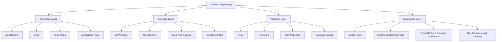
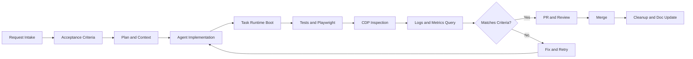
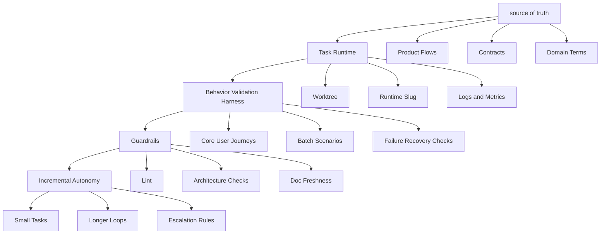
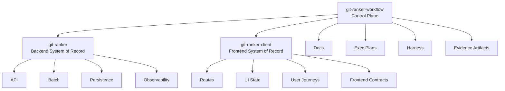

# Harness Engineering 시각자료 가이드

이 문서는 [_posts/2026-03-22-harness-engineering-for-junior-backend-developer.md](../_posts/2026-03-22-harness-engineering-for-junior-backend-developer.md) 글에 넣을 수 있는 시각자료 초안입니다.

원칙은 두 가지입니다.

1. 구조와 플로우는 `Mermaid`로 그립니다.
2. 분위기와 컨셉을 전달하는 대표 이미지는 `PNG`로 생성합니다.

---

## 1. 네 개의 기술 레이어

### 권장 위치

- `## 네 개의 기술 레이어` 바로 아래

### 용도

- OpenAI식 하네스를 한 장으로 압축해서 보여주는 핵심 구조도
- 글의 기술 설명을 읽기 전에 독자가 전체 구조를 먼저 잡도록 돕는 이미지

### Mermaid



### 캡션 초안

> OpenAI식 하네스는 단일 도구가 아니라, 지식 저장소, 실행 환경, 검증 체계, 가드레일이 겹쳐진 개발 시스템에 가깝다.

---

## 2. 안정적 플로우

### 권장 위치

- `## 안정적 플로우의 구성 원리` 아래

### 용도

- "안정성"이 단순 무결함이 아니라 재현-수정-재검증 가능한 루프라는 점을 시각적으로 보여주는 플로우차트

### Mermaid



### 캡션 초안

> OpenAI가 만든 안정성은 버그가 없다는 상태보다, 실패를 다시 같은 루프로 넣어 교정할 수 있는 반복 가능성에 가깝다.

---

## 3. Git Ranker 적용 로드맵

### 권장 위치

- `# Git Ranker 적용 계획` 바로 아래

### 용도

- 글의 후반부를 읽는 독자가 "그래서 실제로는 어떤 순서로 도입하나"를 한눈에 이해하도록 돕는 로드맵

### Mermaid



### 캡션 초안

> Git Ranker에 하네스를 적용할 때 중요한 것은 OpenAI를 복제하는 것이 아니라, 자율성이 올라갈 수밖에 없는 순서를 지키는 것이다.

---

## 4. Git Ranker 제어 구조

### 권장 위치

- `# Git Ranker 재설계 관점` 아래

### 용도

- `git-ranker-workflow`, `git-ranker`, `git-ranker-client`의 역할 분담을 구조적으로 보여주는 다이어그램

### Mermaid



### 캡션 초안

> 하네스는 애플리케이션 코드 위에 덧씌우는 부속물이 아니라, 두 저장소를 하나의 제품처럼 읽고 검증하게 만드는 조율 레이어다.

---

## 5. 대표 이미지 프롬프트: Harness Engineering 개념도

### 권장 위치

- 글 상단 대표 이미지
- 또는 `# OpenAI Harness Engineering 정리` 아래

### 용도

- 이 글 전체의 분위기와 개념을 한 장으로 전달하는 히어로 이미지

### PNG 프롬프트

```text
Create a clean editorial-style technical illustration for a Korean engineering blog post about "Harness Engineering".

Scene:
- A central AI coding agent workspace at a desk, but the focus is not the model itself.
- Surround the workspace with four visible system layers:
  1. documentation and architecture notes,
  2. isolated runtime windows,
  3. browser validation / logs / metrics panels,
  4. lint / rule / cleanup panels.
- The composition should show that the AI is inside a carefully designed control system.
- Include subtle connections between documents, runtime, browser inspection, logs, metrics, and rule engines.

Style:
- modern technical editorial illustration
- clean white or very light warm-gray background
- restrained palette: navy, teal, muted green, soft orange accents
- precise, minimal, intelligent, non-corporate
- slightly isometric or layered dashboard feel
- polished and realistic enough for a serious backend engineering article

Avoid:
- cyberpunk style
- purple neon
- anime look
- overly futuristic robot imagery
- too many floating UI panels
- busy text-heavy screens
- stock-photo look

Output:
- 16:9 PNG
- high resolution
- no visible watermark
- if text appears, keep it minimal and in English only
```

---

## 6. 대표 이미지 프롬프트: Git Ranker control plane

### 권장 위치

- `# Git Ranker 재설계 관점` 아래

### 용도

- OpenAI 개념을 내 프로젝트로 번역하는 장면을 한 장으로 보여주는 이미지

### PNG 프롬프트

```text
Create a polished technical concept illustration showing a personal project called "Git Ranker" adopting an OpenAI-style harness workflow.

Scene:
- At the center, a "control plane" repository represented as a structured hub with docs, plans, observability, and validation.
- On the left, a backend system with API, batch processing, database, logs, and metrics.
- On the right, a frontend system with routes, UI states, and user journeys.
- Connect the center hub to both sides with visible workflow lines.
- Around the whole system, show an isolated task runtime concept: worktree, browser validation, log query, metrics graph.
- The feeling should be "one developer building a disciplined agent-first workflow", not "huge enterprise infrastructure".

Style:
- modern systems diagram meets editorial illustration
- clean and technical, but warm enough for a personal reflective blog
- white or very light background
- muted blue, green, charcoal, soft orange accents
- clear hierarchy, spacious layout
- suitable for a backend engineering blog post

Avoid:
- cartoonish mascots
- exaggerated sci-fi server rooms
- hacker aesthetics
- dark mode only composition
- generic cloud icons everywhere
- messy small text

Output:
- 16:9 PNG
- high resolution
- no watermark
- minimal text only, if necessary
```

---

## 7. 추가 이미지 프롬프트: 다중 신호 검증

### 권장 위치

- `### 4. 다중 신호 검증` 아래

### 용도

- 테스트만이 아니라 브라우저, 로그, 메트릭, 리뷰 피드백이 함께 성공 판정을 만든다는 점을 시각적으로 보강

### PNG 프롬프트

```text
Create a technical editorial illustration about multi-signal validation in an AI-assisted software workflow.

Scene:
- A single bug-fix task shown across multiple synchronized views:
  - code diff,
  - browser preview,
  - console / network inspection,
  - structured logs,
  - metrics chart,
  - pull request feedback.
- The image should make it obvious that success is not judged by tests alone, but by multiple correlated signals.
- Arrange these views around a central task card or runtime slug.

Style:
- crisp systems-oriented visual
- clean background
- serious engineering tone
- balanced whitespace
- subtle color-coded signals: blue for runtime, green for success, orange for warning

Avoid:
- generic futuristic AI robot
- cluttered dashboard overload
- bright neon colors
- low-information decorative shapes

Output:
- 3:2 or 16:9 PNG
- high resolution
- minimal or no text
```

---

## 사용 순서 제안

가장 우선순위가 높은 것은 아래 세 개입니다.

1. `네 개의 기술 레이어` Mermaid
2. `안정적 플로우` Mermaid
3. `Harness Engineering 개념도` PNG

여유가 있으면 아래를 추가하면 좋습니다.

4. `Git Ranker 적용 로드맵` Mermaid
5. `Git Ranker control plane` PNG
6. `다중 신호 검증` PNG
